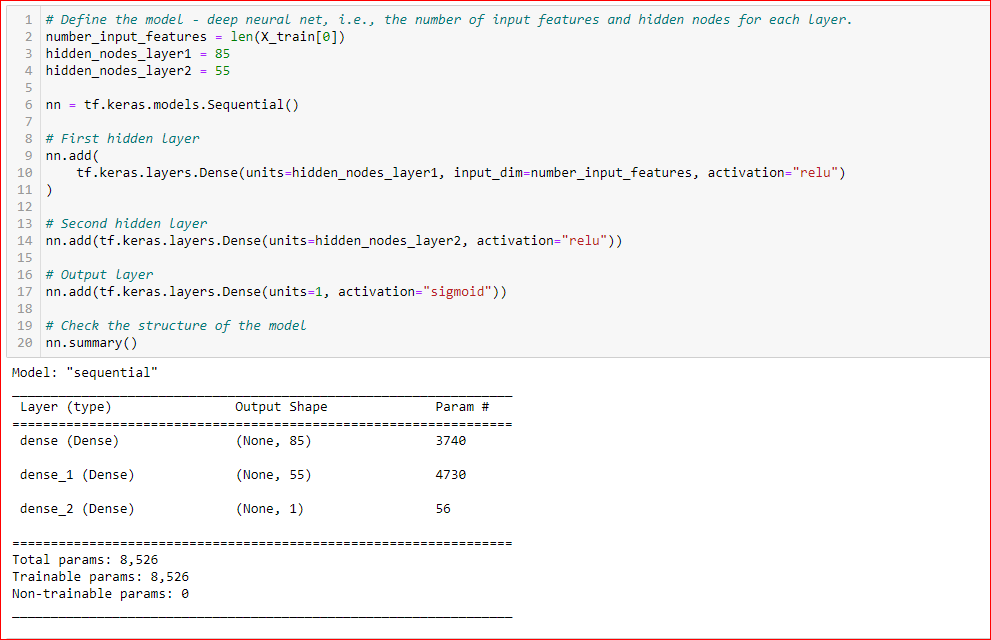
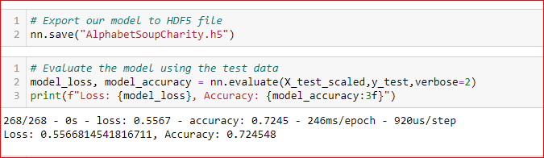
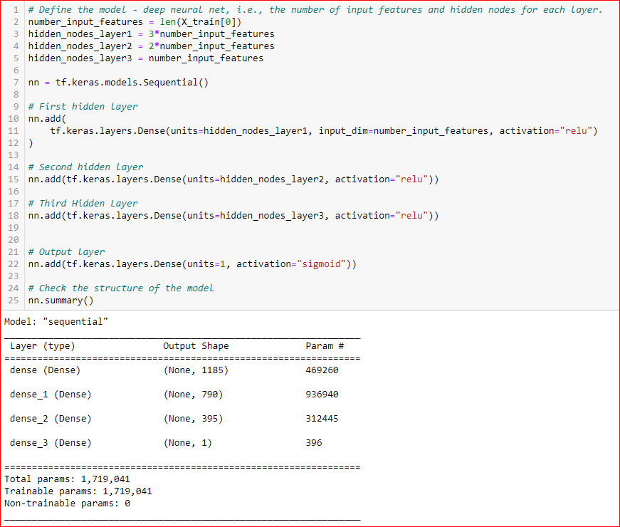
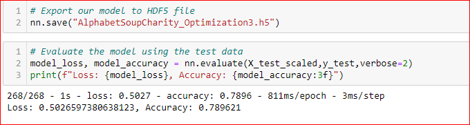
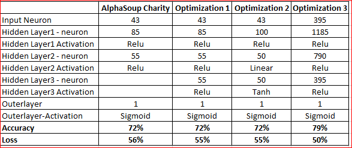

# Neural_Network_Charity_Analysis

## Overview of the Analysis:
With our knowledge of machine learning and neural networks,  used the features in the provided dataset to help Beks create a binary classifier that is capable of predicting whether applicants will be successful if funded by Alphabet Soup.

### Results:
* Data Preprocessing:

    * What variable(s) are considered the target(s) for your model?
    IS_SUCCESSFUL- was the target variable.

    * What variable(s) are considered to be the features for your model?

         APPLICATION_TYPE, AFFILIATION,CLASSIFICATION,  USE_CASE, ORGANIZATION,INCOME_AMT, ASK_AMT 

    * What variable(s) are neither targets nor features, and should be removed from the input data?

        EIN, NAME , STATUS, SPECIAL_CONSIDERATIONS

* Compiling, Training, and Evaluating the Model
    * How many neurons, layers, and activation functions did  you select for your neural network model, and why?
    
        The number of neurons used were 85 for fiest hidden layer & 55 for the second layer. Selected 2 times the feature layer for the neurons. Used RElu activation function to allow our hidden layer to identify and train on nonlinear relationships in the dataset.

        
        
    * Were you able to achieve the target model performance?

        With the above criteria , was able to achieve only 72% accuracy. 

        

    * What steps did you take to try and increase model performance?

        Increased the number of hidden layers to 3. Also made the number of neurons for the hidden layer multiples of the feature. The first hidden layer it was 3 times the input_dim, for the second , 2 times the input_dim & for the third it was equal to input_dim. Dropped the Status & Special consideration column . Added & binned the Name column. 

         

       
        
        Was able to get 79% accuracy with 50% loss.

        

### Summary

    The deep learning model increased the accuracy slightly but it was slow when hidden layer was increased to 3. The random forest model could have done & acheived the same result.It would have run efficiently on the large datasets. Below is the summary of the optimization result with the deep learning .

